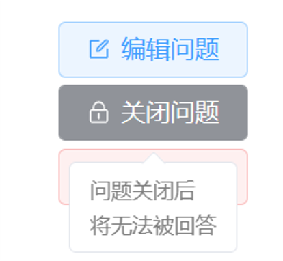
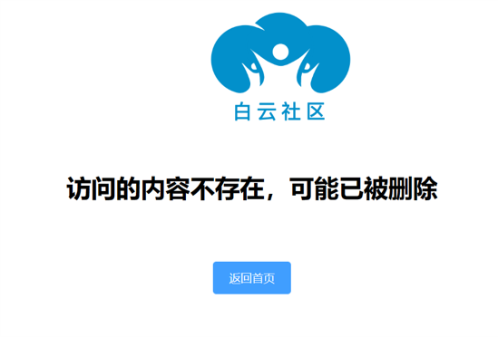
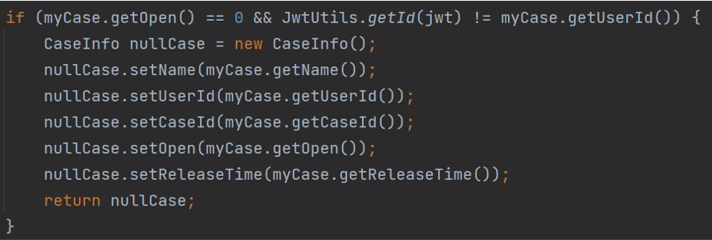

# CS3604-1-group5

## 小组信息

- 组长：吴基洋
- 组员：朱楷文，陈梓钊，龚子钦，程凯文

## 项目信息

### 项目名称

白云社区，取自“不为怜同病，何人到白云”。

### 目前进度

| 迭代 | 进度 |
| :--: | :--: |
| 界面原型 | Done! |
| 技术原型 | Done! |

### 特色与创新点

#### 功能丰富
+ **发布文章：** 共享信息，发起提问，回答提问
+ **评价文章：** 点赞，收藏，关注，评论，点踩
+ **搜索文章：** 模糊搜索，语义搜索
+ **用户互动：** 回复评论，关注，私信
+ **用户形象立体化：** 个人信息维护，活动历史维护
+ **推荐系统：** 向用户推荐案例、问答、用户
+ **检测系统：** 自动屏蔽不当内容
+ **社区管理：** 管理员处理用户举报，可以禁言用户、删除文章
+  .....

#### 用户友好
+ **界面简约美观：** 帮助用户迅速识别页面主要元素，了解主要功能。
  
+ **功能引导完善：** 以清晰醒目的文字、图标、颜色等帮助用户了解功能。
  

#### 鲁棒
+ **充分考虑意外情况下（如并发）备选流的处理** ：用户 B 回答用户 A 的问题，在进入回答界面后，用户 A 删除了该问题，此时用户 B 提交回答后，将被告知问题已被删除。

#### 安全
+ **充分考虑可能的恶意攻击，保护用户数据**：
例：案例被发布者关闭后，他人将无法通过网页查看。若攻击者直接访问 URL 发送网络请求，也会被后端拦截器拦截。

### 架构与关键技术

#### 软件架构

#### 关键技术

+ **语义搜索**: 
  

+ **内容检测**：
  

+ **推荐系统**：
  

### 评比结果
获得课程最佳项目称号！
